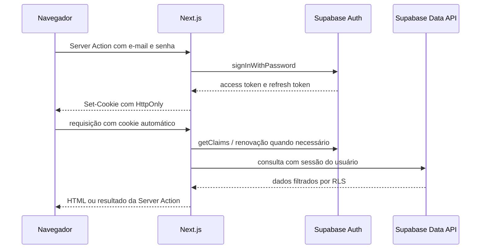

# Arquitetura de Autenticação e Sessão

## Objetivo

Definir como o Organizador Financeiro autentica usuários, mantém sessões e protege dados financeiros sem expor tokens de sessão ao JavaScript do navegador.

Este documento cobre a arquitetura do MVP. A implementação operacional está descrita em [[docs/planos/plano-de-implementacao-autenticacao]].

## Decisão arquitetural

O projeto usará o Supabase Auth como provedor de identidade e um modelo server-first dentro do Next.js App Router.

O navegador enviará formulários e acionará Server Actions, mas não usará o cliente Supabase para ler ou renovar a sessão. O cliente Supabase de servidor será criado por requisição e usará cookies de sessão com `HttpOnly`.

Essa decisão significa que:

- o navegador ainda armazena um cookie de sessão, pois isso é necessário para manter a sessão web;
- o cookie não pode ser lido por JavaScript, `localStorage`, `sessionStorage` ou estado React;
- access tokens e refresh tokens não serão enviados em props, HTML, JSON, URLs ou logs;
- Client Components continuarão permitidos para UI, mas chamarão o servidor por Server Actions;
- a identidade confiável sempre será obtida no servidor a partir da sessão validada.

## Componentes e responsabilidades

### Supabase Auth

- mantém usuários, credenciais, sessões, refresh tokens e confirmação de e-mail;
- emite access token JWT e refresh token;
- executa rotação de refresh tokens;
- fornece recuperação de senha e, futuramente, MFA.

### Next.js

- recebe credenciais em Server Actions;
- cria o cliente Supabase server-side por requisição;
- grava e renova cookies de sessão;
- executa o `proxy` para renovação e redirecionamentos antecipados;
- protege páginas, Server Actions e Route Handlers;
- nunca usa `SUPABASE_SECRET_KEY` nos fluxos normais do usuário.

### Banco e RLS

- `auth.users` é a fonte de verdade da identidade;
- `public.profiles` é um espelho controlado do usuário autenticado;
- tabelas financeiras permanecem protegidas por ownership e `auth.uid()`;
- o `user_id` nunca é aceito como identidade confiável vindo do cliente.

## Fluxo de sessão



O `proxy` deve chamar `getClaims()` para verificar/renovar a sessão, mas não é a única barreira de autorização. Páginas, loaders, Server Actions e casos de uso devem repetir a verificação quando acessarem dados ou executarem mutações.

## Cookies e armazenamento

Os cookies de sessão devem ser configurados com:

- `HttpOnly: true`;
- `Secure: true` em produção;
- `SameSite: Lax`;
- `Path: /`;
- validade controlada pelo Supabase, sem cópia para cookies próprios.

O access token deve manter validade curta. O valor padrão de aproximadamente uma hora é adequado ao MVP; sessões por tempo máximo, timeout de inatividade e sessão única podem ser configurados depois conforme o plano do Supabase e a decisão de produto.

Logout deve usar `scope: "local"` para encerrar apenas a sessão atual. Uma ação separada poderá usar `scope: "global"` para sair de todos os dispositivos.

## Superfície de rotas

Rotas públicas:

- `/login`;
- `/esqueci-senha`;
- `/auth/confirm`;
- `/redefinir-senha`.

Rotas privadas:

- dashboard;
- páginas financeiras;
- Server Actions de leitura e mutação;
- futuros Route Handlers que retornem dados do usuário.

O `proxy` deve fazer redirecionamentos antecipados, mas a verificação definitiva ocorre próxima à fonte de dados. Nenhuma página ou layout visual deve ser considerado autorização suficiente.

## Fluxos do MVP

### Login

1. O usuário envia e-mail e senha para uma Server Action.
2. O servidor valida os campos com Zod.
3. O servidor chama `signInWithPassword`.
4. A sessão é gravada em cookies `HttpOnly`.
5. O usuário é redirecionado para o dashboard.
6. Falhas retornam mensagem genérica, sem revelar se o e-mail existe.

### Logout

O servidor chama `signOut({ scope: "local" })`, limpa a sessão e redireciona para `/login`. Access tokens já emitidos podem permanecer válidos até sua expiração; por isso o projeto não deve usar expiração longa para o JWT.

### Recuperação de senha

O usuário solicita recuperação por e-mail. O link deve apontar para uma rota controlada pelo projeto, que valida `token_hash` e encaminha para a redefinição. O parâmetro de destino só pode aceitar caminhos internos previamente permitidos.

### Cadastro

O cadastro público fica desabilitado no primeiro momento. O usuário inicial será criado no painel do Supabase. Caso o produto passe a aceitar cadastro, será necessário adicionar confirmação de e-mail, política de senha, CAPTCHA, SMTP próprio e tratamento contra enumeração de contas.

## Segurança e autorização

- usar `getClaims()` para validar a identidade em páginas e dados;
- usar `getUser()` quando for necessário consultar o registro atualizado do usuário;
- não usar `getSession()` como prova suficiente de autorização;
- manter `SUPABASE_SECRET_KEY` fora do frontend e dos fluxos de usuário;
- manter `anon` sem acesso às tabelas financeiras;
- manter grants e RLS conforme a política de exposição existente;
- usar `using` e `with check` com ownership em políticas de atualização;
- validar autenticação dentro de cada Server Action;
- tratar Server Actions e Route Handlers como endpoints públicos;
- preservar `SameSite=Lax` e a validação de origem do Next.js para reduzir CSRF;
- não permitir redirecionamento externo controlado por query string;
- nunca registrar cookies, tokens, senhas ou links de recuperação.

O MFA é recomendado como próxima camada para o usuário financeiro, mas não é necessário para concluir o primeiro fluxo de login.

## Cache e renderização

Rotas autenticadas não devem usar ISR ou cache compartilhado. Respostas que renovam sessão precisam permanecer privadas e sem armazenamento compartilhado. O `proxy` já deve propagar os headers recebidos pelo adaptador SSR quando houver renovação.

## Modelo de confiança

```txt
UI do navegador
  não é fonte de identidade

Server Action / Server Component
  valida sessão e chama caso de uso

Caso de uso
  obtém usuário autenticado no gateway

Supabase Data API
  aplica JWT e RLS

Postgres
  garante ownership e constraints
```

## Critérios de conformidade

A arquitetura estará implementada quando:

- não houver sessão em `localStorage` ou `sessionStorage`;
- `document.cookie` não puder ler os cookies de autenticação;
- Client Components não receberem tokens;
- login, logout e recuperação forem executados no servidor;
- páginas privadas redirecionarem usuários anônimos;
- cada Server Action validar autenticação;
- RLS continuar isolando os registros por usuário;
- SMTP, URLs de redirect, limites e proteção contra abuso estiverem configurados antes da produção;
- testes comprovarem ausência de vazamento de tokens e isolamento entre usuários.

## Referências externas

- Supabase, [Creating a client for SSR](https://supabase.com/docs/guides/auth/server-side/creating-a-client)
- Supabase, [User sessions](https://supabase.com/docs/guides/auth/sessions)
- Supabase, [Advanced SSR guide](https://supabase.com/docs/guides/auth/server-side/advanced-guide)
- Supabase, [Signing out](https://supabase.com/docs/guides/auth/signout)
- Next.js, [Authentication guide](https://nextjs.org/docs/app/guides/authentication)
