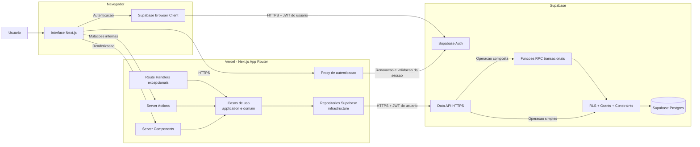
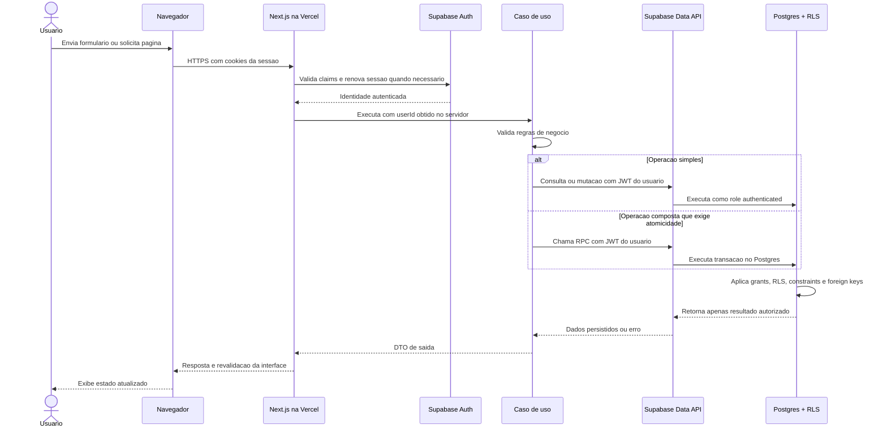

# Arquitetura Serverless com Vercel e Supabase

## Objetivo

Este documento define a arquitetura de execucao e acesso a dados do MVP do Organizador Financeiro Pessoal.

A solucao deve funcionar em producao apenas com:

- aplicacao `Next.js` hospedada na Vercel
- funcoes gerenciadas pela Vercel, geradas pelo runtime do Next.js
- Supabase Auth
- Supabase Data API
- Supabase Postgres com RLS, grants e constraints

Nao existe backend separado, servidor dedicado, VPS, container permanente ou microservico no MVP.

## Decisao Arquitetural

O projeto adota um monolito modular executado como aplicacao full-stack Next.js.

A Vercel fornece a camada de execucao sob demanda. O Supabase fornece autenticacao, API de dados e persistencia. A aplicacao acessa o Supabase por HTTPS usando `@supabase/supabase-js` e `@supabase/ssr`.

O runtime da aplicacao nao abre conexao Postgres direta e nao mantem pool proprio de conexoes.

## Diagrama UML de Componentes

O Mermaid nao possui uma notacao completa para componentes UML. O diagrama abaixo usa `flowchart` como representacao equivalente dos componentes, limites de execucao e dependencias externas.

## Responsabilidades

| Componente | Responsabilidade |
| --- | --- |
| Navegador | Renderizar a interface e iniciar autenticacao, consultas permitidas e Server Actions. |
| Next.js na Vercel | Compor a aplicacao, validar entrada, autenticar chamadas e executar casos de uso sob demanda. |
| `domain` | Representar regras financeiras puras, sem dependencia de Next.js, Vercel ou Supabase. |
| `application` | Orquestrar casos de uso e depender apenas de contratos internos. |
| `infrastructure` | Implementar repositories e adaptadores para Supabase. |
| `interface` | Validar formatos de entrada com Zod e adaptar saidas. |
| Supabase Auth | Emitir, renovar e validar a identidade autenticada. |
| Supabase Data API | Expor operacoes autorizadas sobre o Postgres por HTTPS. |
| Supabase Postgres | Persistir dados e aplicar RLS, grants, foreign keys e constraints. |

## Fluxo de Dados Autenticado

## Modelo de Execucao Serverless

Server Components, Server Actions, Proxy e Route Handlers podem ser executados em instancias gerenciadas e reutilizadas pela Vercel.

Por isso:

- nenhuma regra pode depender de memoria compartilhada entre requisicoes
- nenhum estado de usuario pode ser armazenado em variavel global
- o client Supabase de servidor deve ser criado dentro do contexto de cada requisicao
- cookies e identidade devem ser lidos novamente em cada operacao sensivel
- arquivos locais do runtime nao devem ser usados como armazenamento persistente
- operacoes devem ser curtas, deterministicas e tolerantes a novas invocacoes

O browser client pode usar o comportamento singleton fornecido por `createBrowserClient`, pois ele pertence a sessao do navegador. Essa regra nao se aplica ao server client.

## Acesso ao Supabase

### Fluxos normais do usuario

Server Components, Server Actions e repositories usam:

- `NEXT_PUBLIC_SUPABASE_URL`
- `NEXT_PUBLIC_SUPABASE_PUBLISHABLE_KEY`
- JWT recuperado dos cookies da sessao

Esse contexto faz as consultas chegarem ao banco como role `authenticated`, mantendo RLS e ownership ativos.

O `userId` nunca deve ser aceito como identidade confiavel quando vier do cliente. Ele deve ser obtido da sessao validada no servidor.

### Chave secreta

`SUPABASE_SECRET_KEY` e uma credencial server-only que ignora RLS e nao faz parte dos fluxos normais do MVP.

Ela nao deve ser usada em:

- repositories de contas, categorias, transacoes ou compromissos
- Server Actions do usuario
- Server Components autenticados
- dashboard ou planejamento mensal
- codigo enviado ao navegador

Seu uso futuro exige um caso administrativo explicito, revisao de autorizacao e isolamento em um adaptador proprio. A existencia da variavel nao autoriza seu uso automatico.

## Operacoes Atomicas

Uma sequencia de chamadas independentes pela Data API nao representa uma unica transacao de banco.

Quando um caso de uso exigir atomicidade, a operacao deve ser implementada dentro do Supabase como funcao RPC transacional. Exemplos futuros:

- criar uma compra no credito e seu compromisso correspondente
- criar a saida de pagamento e liquidar o compromisso

Por padrao, funcoes desse tipo devem:

- respeitar o JWT do usuario e o isolamento por ownership
- preferir `SECURITY INVOKER`
- permanecer sem privilegios publicos desnecessarios
- validar novamente regras criticas no banco
- ser versionadas por migration

Essa estrategia preserva atomicidade sem introduzir servidor persistente ou conexao Postgres direta na Vercel.

## Server Actions e Route Handlers

Server Actions sao a camada de entrega padrao para mutacoes iniciadas pela interface da aplicacao.

Uma Server Action deve apenas:

1. obter e validar a identidade autenticada
2. validar o formato da entrada
3. compor dependencias
4. chamar um caso de uso
5. adaptar a resposta e revalidar a interface quando necessario

Route Handlers so devem ser criados quando existir necessidade real de endpoint HTTP, como webhook, integracao externa ou consumidor diferente da propria interface Next.js.

Nem Server Actions nem Route Handlers devem concentrar regra de negocio.

## Itens Fora da Arquitetura do MVP

Nao fazem parte da solucao atual:

- backend Express ou NestJS
- API REST separada como centro da aplicacao
- servidor dedicado ou VPS
- containers de aplicacao em producao
- microservicos
- workers persistentes
- conexao direta com Postgres pela aplicacao
- ORM que dependa de conexao Postgres direta
- pool de conexoes mantido pela aplicacao
- Supabase Edge Functions sem necessidade especifica aprovada

## Impacto Pratico

Beneficios:

- nenhuma infraestrutura de servidor precisa ser administrada pelo projeto
- custo operacional inicial reduzido
- escalabilidade gerenciada por Vercel e Supabase
- RLS continua sendo aplicado em consultas normais do usuario
- dominio e casos de uso permanecem independentes do mecanismo de entrega

Tradeoffs:

- o runtime nao pode depender de estado em memoria entre requisicoes
- operacoes compostas exigem RPC para garantir atomicidade
- limites de execucao e quotas da Vercel e do Supabase devem ser monitorados
- cada requisicao autenticada precisa reconstruir o contexto da sessao

## Criterios de Conformidade

Uma implementacao esta aderente a esta arquitetura quando:

- roda apenas com Vercel e Supabase em producao
- nao exige processo de backend permanente
- usa Data API por HTTPS nos repositories
- cria o server client por requisicao
- usa a identidade validada no servidor
- preserva grants, RLS e constraints
- mantem regra de negocio em `domain` e `application`
- usa Server Actions como entrega padrao para mutacoes internas
- usa RPC para operacoes compostas que exigem transacao
- nao utiliza a secret key nos fluxos normais do usuario

## Referencias

- Supabase Docs, Serverless Drivers: https://supabase.com/docs/guides/database/connecting-to-postgres/serverless-drivers
- Supabase Docs, Server-Side Auth for Next.js: https://supabase.com/docs/guides/auth/server-side/creating-a-client
- Supabase Docs, Data REST API: https://supabase.com/docs/guides/api
- Vercel Docs, Functions: https://vercel.com/docs/functions
- Next.js Docs, Mutating Data: https://nextjs.org/docs/app/getting-started/mutating-data
- Next.js Docs, Backend for Frontend: https://nextjs.org/docs/app/guides/backend-for-frontend
